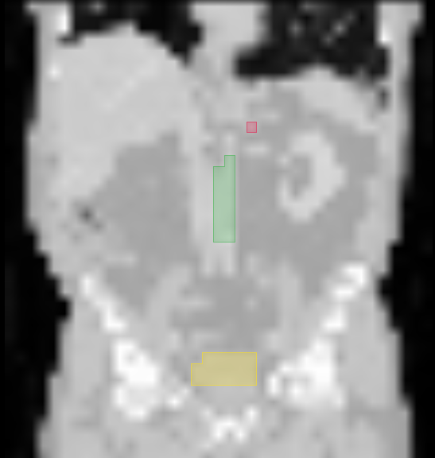

# ml-py-project-template

ML Python 3.12 project template.

## 1. Rollout

During repo creation, pick `ml-py-project-template` in a `Repository template` drop-down menu.

## 2. Post-rollout

Certain values/files are expected to be updated.

- Update codeowner(s) in `.github/CODEOWNERS`.
- Update the package name at `src/ml_py_project`, and in `src/<your_package>/__init__.py`.
- Update project name in `pyproject.toml` under `project` section.
- Remember to adjust your tests:
  - adjust import statements
  - adjust test marks if needed in `pyproject.toml` under `tool.pytest.ini_options.marks`
  - adjust `pytest` fixtures in `tests/**.py`
- Ask GitHub admin to onboard the repo (e.g., @arturo-guridi-snkeos). Specify:
  - if you need CI enabled
  - if you need training in ClearML enabled

## 3. Integrations

### 3.1. GitHub Actions CI

This template relies on repo-specific reusable GitHub Actions workflows (in in `.github/workflows/`) from the [snkeos/ana-workflows](https://github.com/snkeos/ana-workflows) repository. Dependabot (with a configuration in `.github/dependabot.yml`) will take care of updating the workflows versions once a new `ana-workflows` has a new release.

### 3.2. snketorch/ClearML

The repo comes with a fully functional 3D Segmentation example that can be found in `src/ml_py_project`. It includes:

- `utils/data_generation.py` - a data generation entry point (creates a [ClearML dataset](https://app.snkeos.hosted.allegro.ai/datasets/simple/2e05f2046e2344e9b5d99762e98565ac/datasets)).
- `main.py` - a training entry point (runs a [training Task](https://app.snkeos.hosted.allegro.ai/projects/2e05f2046e2344e9b5d99762e98565ac/experiments/ad302d840b084b2786e5d51ed961e801/)).
- `config/` - corresponding hydra configuration files.

You can locally train a model on this 3D Segmentation example with the following command:

```bash
cd src/ml_py_project
python main.py mlops.execute_on_cluster=False mlops.init_task=False
```

Feel free to adapt to your needs for ml app or delete in case you want to create a lib.

Sample images and annotations of the example project:

| Axial                               | Coronal                               | Sagittal                               |
| ----------------------------------- | ------------------------------------- | -------------------------------------- |
|  |  |  |

### 3.3. Validation Reports

> **Note:** exact behavior of pytest in CI is controlled by the ana-workflows reusable workflow components that are related to execution of pytest. Refer to ana-workflows for up-to-date information.

This template allows for automatic generation of a validation report.

Step 1: project specific adjustments to the tests

- adjust the validation tests
  - in `tests/conftest.py` change path to main.py in `run_experiment()`
  - in `tests/conftest.py` change path to data_generation.py in `generate_data()`
  - adapt existing tests so that they complete successfully. Test with `pytest tests -m validation`
- adapt project specific parameters in `tests/templates/report_parameters.json`
- optionally adapt the report template `tests/templates/template.docx`
- optionally add more validation tests to your project

Step 2: Release

- On the tag push workflow the validation tests are triggered which results will be exported to a validation report which can be found as an artifact of release

### 3.4. pre-commit

This template relies on `pre-commit` for controlling the code quality. There are two files that configure this behavior:

- `.pre-commit-config.yaml` - defines hooks that are executed on your code.
- `pyproject.toml` - defines configuration parameters for most of the hooks (as long as a hook supports reading from this file).

> **Note:** default versions of these files comply with CI base code quality checks. You are expected (and allowed) to deviate in what hooks you run on your code (and how they are configured) but we advise to "add on top" rather than remove hooks or some of their configurations. Additionally, consult with ml-toolchain to check what is expected by CI.

To run pre-commit hooks on **all** of your files:

```shell
pre-commit run -a # or `make check-all`
```

Normally (with current configuration) when executed, `pre-commit` will report problems and try to fix them when possible. To run `pre-commit` hooks **only on changed** (staged) files:

```shell
pre-commit run # or `make check-diff`
```

To limit the scope check provide a path to a file:

```shell
pre-commit run --files src/path/to/file
```

You can install pre-commit hooks as git hooks:

```shell
pre-commit install
```

and `pre-commit` will automatically run on `git commit`.

Later, to bypass this you can add a flag:

```shell
git commit --no-verify -m "my commit message"
```

### 3.5. pytest/coverage

This template relies on `pytest` and `coverage` for management and execution of tests of different scopes and calculating test coverage values. This behavior is controlled by corresponding sections in `pyproject.toml`.

> **Note:** each test must be marked with a relevant `@pytest.mark.<mark>()` fixture where `<mark>` value has to match one of the marks defined in `pyproject.toml::tool.pytest.ini_options.markers` to mark the scope of the test.
> **Note:** exact behavior of pytest in CI is controlled by the ana-workflows reusable workflow components that are related to execution of pytest. Refer to ana-workflows for up-to-date information.

To execute **all** tests:

```shell
pytest
```

Add `-m <mark>` or `<path/to/my/test.py>` to execute a single mark or single test, respectively.

To execute all tests marked as `unit` and report coverage:

```shell
make coverage
```

Pytest is also configured to be used in `Python` VSCode extension.

### 3.6. VSCode

This template contains a workspace configuration for `VSCode` in `.vscode/settings.json`. Feel free to export additional settings from `VSCode` to share your setup with collaborators.

> **Note:** be careful when creating new/editing default settings: e.g. changing the default formatter may lead to interference with `pre-commit` and CI further down the line.

To discover the default values/export them to `settings.json` navigate to `File` > `Preferences` > `Settings` > `Workspace` scope, then use search to find what you need.

### 3.7. Dev Containers

This template assumes that development is carried out in Dev Containers. Default spec is provided in `.devcontainer/devcontainer.json` - it holds reasonable defaults that are tested with VSCode's dev container extension.

> **Note:** default spec includes the `customizations.vscode.extensions` section to define what extensions to install into VSCode dev container server. Use this to save time after container rebuilds.

Following are some useful commands in case you use VSCode:

- To build (if was not built before) and open your workspace in a dev container: `Ctrl-Shift-P` > `Dev Containers: Reopen in Container`
- To exit the container: `Ctrl-Shift-P` > `Dev Containers: Reopen in WSL`
- To force rebuild the container and open your workspace in a dev container: `Ctrl-Shift-P` > `Dev Containers: Rebuild Container Without Cache`

## 4. Synchronization with template

Either manual, or add the ml-py-project-template as an additional remote repository:

1. Add additional remote:
   `git remote add template git@github.com:snkeos/ml-py-project-template.git`
2. Pull changes from the new remote:
   `git pull template main --allow-unrelated-histories`
